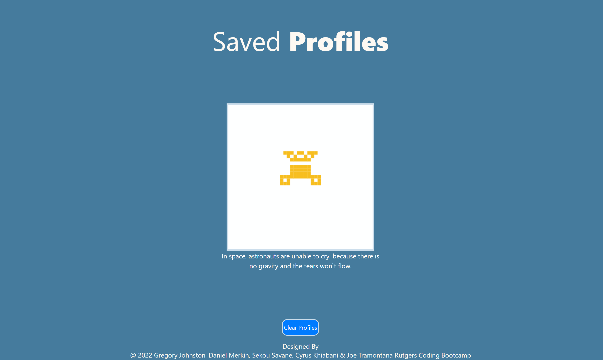

# Random-Profile-Generator

## USER STORY:

```md
AS AN anonymous social media user
I WANT a quick way to generate assets for my new account
SO THAT I can save time while still having a unique looking profile
```

## Table of Contents
  - [USER STORY:](#user-story)
  - [Table of Contents](#table-of-contents)
  - [Technologies Used For this Application](#technologies-used-for-this-application)
  - [Screenshot of Landing Page](#screenshot-of-landing-page)
  - [Screenshot of Generate Page](#screenshot-of-generate-page)
  - [Screenshot of Saved Profile Page](#screenshot-of-saved-profile-page)
  - [Deployed URL](#deployed-url)
  - [Contributors](#contributors)

## Technologies Used For this Application

---
```md
* HTML5
* CSS 
* Bootstrap
* Tailwind CSS 
* JavaScript
* pixelencounter API 
* random fact generator API
* JSON
```

## Screenshot of Landing Page
---


```md
This is our landing page for our random profile generator. To start rhe application, you click the genrate button. 
```

## Screenshot of Generate Page
---


## Screenshot of Saved Profile Page



## Deployed URL
---

Click the lightning bolt [⚡](https://dmerk2.github.io/Anon-Profile-Generator/)  to see the random profile generator in action.


## Contributors
---
@ 2022 This project exists thanks to those who contributed. To view their individual projects in Github click their name below. <br>
<br>
<a href="https://github.com/CoffeeEyes28"> Gregory Johnston </a><br>
<a href="https://github.com/dmerk2">Daniel Merkin</a><br>
<a href="https://github.com/ssavane26">Sekou Savane</a><br>
<a href="https://github.com/cykj40" >Cyrus Khiabani </a><br>
<a href="https://github.com/joetrops5">Joe Tramontana</a><br>
